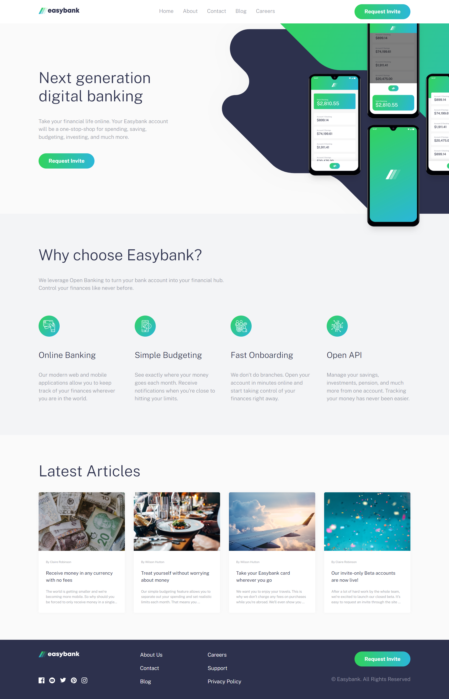
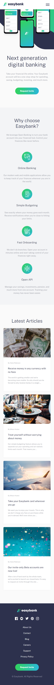

# Frontend Mentor - Easybank landing page solution

This is a solution to the [Easybank landing page challenge on Frontend Mentor](https://www.frontendmentor.io/challenges/easybank-landing-page-WaUhkoDN). Frontend Mentor challenges help you improve your coding skills by building realistic projects.

## Table of contents

- [Frontend Mentor - Easybank landing page solution](#frontend-mentor---easybank-landing-page-solution)
  - [Table of contents](#table-of-contents)
  - [Overview](#overview)
    - [The challenge](#the-challenge)
    - [Screenshot](#screenshot)
      - [Desktop](#desktop)
      - [Mobile](#mobile)
    - [Links](#links)
  - [My process](#my-process)
    - [Built with](#built-with)
    - [What I learned](#what-i-learned)
    - [Useful resources](#useful-resources)
  - [Author](#author)

## Overview

### The challenge

Users should be able to:

- View the optimal layout for the site depending on their device's screen size
- See hover states for all interactive elements on the page

### Screenshot

#### Desktop



#### Mobile



### Links

- Solution URL: [Github](https://github.com/elsayed136/eazybank-landing-page)
- Live Site URL: [Demo](https://eazybank-elsayed.netlify.app/)

## My process

### Built with

- Semantic HTML5 markup
- CSS custom properties
- Flexbox
- CSS Grid
- Mobile-first workflow
- Sass

### What I learned

expand div outside its container

```html
<div class="parent">
  <div class="child"></div>
</div>
```

```css
* {
  box-sizing: border-box;
}
body {
  margin: 0;
  overflow-x: hidden;
}
.parent {
  max-width: 400px;
  margin: 0 auto;
  padding: 1rem;
  position: relative;
  background-color: #c0c2c2;
}
.child {
  width: 100vw;
  position: relative;
  left: calc(-50vw + 50%);
  height: 100px;
  background-color: #535fcf;
}
```

If you want [Guide](https://www.w3docs.com/snippets/css/how-to-make-a-child-div-element-wider-than-the-parent-div.html) to learn more.

### Useful resources

- [sass-guidelin](https://sass-guidelin.es/#architecture) - This helped me for sass architecture 7-1 pattern. I really liked this pattern and will use it going forward.

## Author

- Website - [Github](https://github.com/elsayed136)
- Frontend Mentor - [@elsayed136](https://www.frontendmentor.io/profile/elsayed136)
